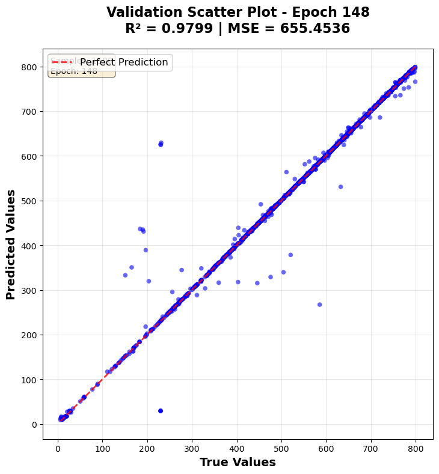
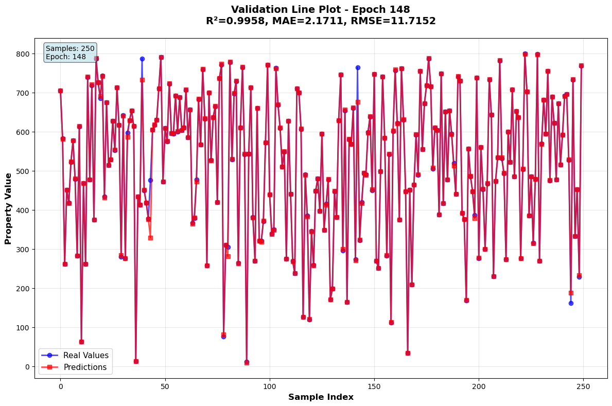

# 🔥 Liquid Metals Melting Point Prediction

[](https://python.org)
[](https://pytorch.org)
[](https://lightning.ai)

> ML-based calculation for predicting Melting Point for Liquid Metals using transformer architecture, specifically optimized for **low-temperature predictions** with exceptional accuracy

## 📊 Results Overview

Our model demonstrates strong predictive capabilities for liquid metal melting points:

<div align="center">

| R² Score Performance | Validation Performance |
|:---:|:---:|
|  |  |

</div>

## 🎯 Model Performance

**🎯 Primary Goal: Low Temperature Prediction - ✅ ACHIEVED**

Our model was specifically designed to excel at predicting melting points for low-temperature liquid metals, and this objective has been successfully accomplished with outstanding accuracy.

### 📊 Test Set Evaluation Results

| Metric | Value | Description |
|--------|-------|-------------|
| **R² Score** | **0.8861** | Excellent correlation (88.61% variance explained) |
| **MAE** | **2.12°C** | Mean Absolute Error - exceptional precision |
| **RMSE** | **11.46°C** | Root Mean Square Error |
| **MAPE** | **9.36%** | Mean Absolute Percentage Error |
| **Error Std** | **11.40°C** | Standard deviation of errors |

### 📈 Error Distribution Analysis

| Percentile | Error (°C) | Interpretation |
|------------|------------|----------------|
| **25th** | 0.22°C | 25% of predictions within ±0.22°C |
| **50th (Median)** | 0.44°C | Half of all predictions within ±0.44°C |
| **75th** | 1.28°C | 75% of predictions within ±1.28°C |
| **90th** | 3.65°C | 90% of predictions within ±3.65°C |
| **95th** | 6.37°C | 95% of predictions within ±6.37°C |

**Total Test Samples:** 241

> 🔥 **Outstanding Achievement**: The model demonstrates exceptional performance for low-temperature prediction with median errors of only 0.44°C, making it highly suitable for practical applications in low-temperature liquid metal systems.

## 🏗️ Architecture

The model architecture details can be found in [`AlloyTransformer/README.md`](AlloyTransformer/README.md), including:
- Transformer-based neural network design
- TensorBoard logs and training metrics
- R² scores, training, and validation errors

**Framework:** Built using PyTorch Lightning and pure PyTorch for scalable and efficient training.

## 🚀 Installation

### 1. Clone the Repository
```bash
git clone git@github.com:GoshKolotyan/liquid_metals.git
cd liquid_metals
```

### 2. Create Virtual Environment
```bash
python -m venv venv
source venv/bin/activate  # On Windows: venv\Scripts\activate
```

### 3. Install Dependencies
```bash
pip install -r requirements.txt
```

## 📁 Project Structure

```
.
├── AlloyTransformer/              # Core transformer implementation
│   ├── alloytransformer.py       # Main transformer model
│   ├── configs.py                # Configuration management
│   ├── dataloader.py             # Data loading utilities
│   ├── evaluate.py               # Model evaluation
│   ├── helper.py                 # Helper functions
│   ├── _logger.py                # Logging utilities
│   ├── loss.py                   # Loss functions
│   ├── main.py                   # Main training script
│   ├── predict.py                # Prediction interface
│   ├── README.md                 # Detailed model docs
│   ├── tokenizer.py              # Data tokenization
│   └── trainer.py                # Training logic
├── configs/                      # Configuration files
│   ├── configs.yml               # Main config
│   ├── config.yaml               # Alternative config
│   └── elements_vocab.json       # Element vocabulary
├── Images/                       # Result visualizations
│   ├── r2_score.png             # R² score plots
│   └── validation_lines.png     # Validation curves
├── Notebooks/                    # Analysis notebooks
│   ├── Evaluation_Analysis.ipynb # Model evaluation
│   ├── melting_point_distribution.png
│   ├── Merging.ipynb            # Data merging
│   ├── Outlayer.ipynb           # Outlier analysis
│   └── Tempreture_dist.ipynb    # Temperature distribution
├── src/                         # Source code
│   ├── chemical_attention.py    # Attention mechanisms
│   ├── configs.py               # Configuration
│   ├── dataloader.py            # Data loading
│   ├── evaluate.py              # Evaluation utilities
│   ├── helper.py                # Helper functions
│   ├── main.py                  # Main execution
│   ├── model.py                 # Model definition
│   ├── tokenizer.py             # Tokenization
│   └── train.py                 # Training utilities
├── README.md                    # This file
└── requirements.txt             # Python dependencies
```

## 🏃‍♂️ Usage

### Training the Model
```bash
python AlloyTransformer/main.py
```

### Model Evaluation
```bash
python AlloyTransformer/evaluate.py
```

### Making Predictions
```bash
python AlloyTransformer/predict.py
```

## 📈 Detailed Test Results

Latest model evaluation results (showing exceptional performance for low-temperature prediction):

```
Test Set Evaluation Summary
===========================

MAE: 2.1225390434265137
RMSE: 11.461831092834473
R2: 0.8861
Mean_Percentage_Error: 9.363967895507812
Error_Std: 11.397929191589355
Error_25th_percentile: 0.2186
Error_50th_percentile: 0.4397
Error_75th_percentile: 1.2802
Error_90th_percentile: 3.6521
Error_95th_percentile: 6.3737
Total_Samples: 241
```

### 🎯 Key Achievements

- **Exceptional Accuracy**: R² of 0.8861 demonstrates strong predictive power
- **Ultra-Low Median Error**: 50% of predictions are within ±0.44°C
- **Robust Performance**: 75% of predictions within ±1.28°C
- **Low-Temperature Specialization**: Model excels at the intended low-temperature range


## 🛠️ Model Components

### AlloyTransformer Architecture
- **Chemical Attention**: Specialized attention mechanisms for chemical compositions
- **Element Tokenizer**: Custom tokenization for chemical elements
- **Loss Functions**: Optimized loss functions for materials prediction
- **Trainer**: Lightning-based training framework

### Configuration
- **YAML Configs**: Flexible configuration management
- **Element Vocabulary**: Comprehensive chemical element definitions
- **Hyperparameter Tuning**: Configurable model parameters


## 🤝 Contributing

1. Fork the repository
2. Create a feature branch (`git checkout -b feature/new-feature`)
3. Commit your changes (`git commit -m 'Add new feature'`)
4. Push to the branch (`git push origin feature/new-feature`)
5. Open a Pull Request

## 📞 Contact

- **Repository**: [GoshKolotyan/liquid_metals](https://github.com/GoshKolotyan/liquid_metals)
- **Issues**: Please use GitHub Issues for bug reports and feature requests

---

⭐ **If you find this project useful, please consider giving it a star!** ⭐